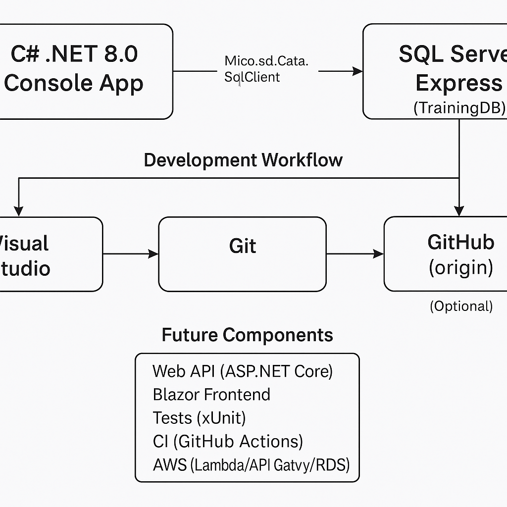

\# PHC Bootcamp Project Documentation

\## Overview

This folder contains project documentation, including:

\- System architecture

\- Database diagrams

\- API specifications

\- Development notes

\- Setup guides

\## Current Status

\- Backend: C# .NET 8 console app connected to SQL Server.

\- Features: Read and display student data.

\- Next: Add Create, Update, Delete features.

\## How to Use This Folder

\- Add `.md` files for each documentation topic.

\- Use images (`.png`, `.jpg`) for diagrams and screenshots.

\- Keep documents updated with code changes.

